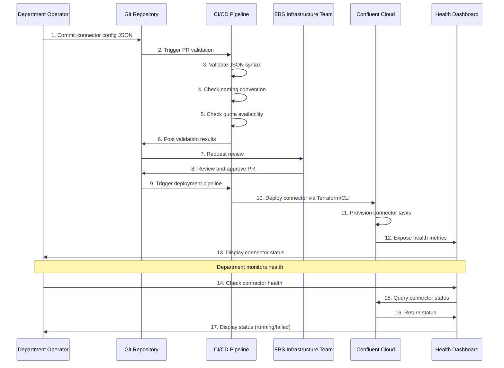
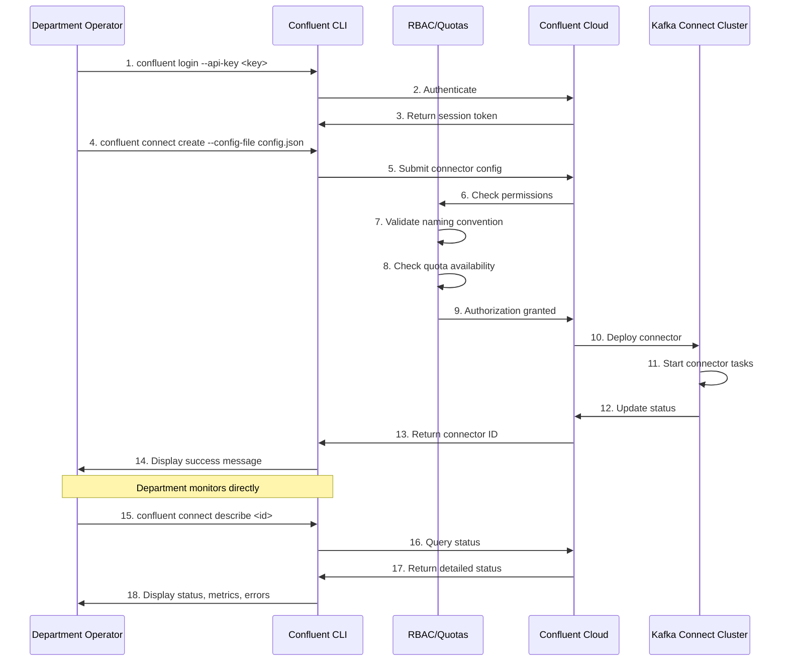
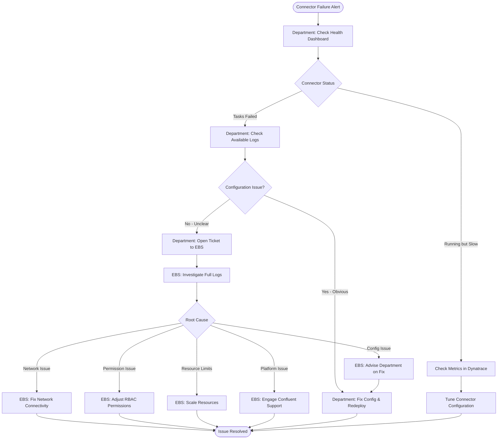
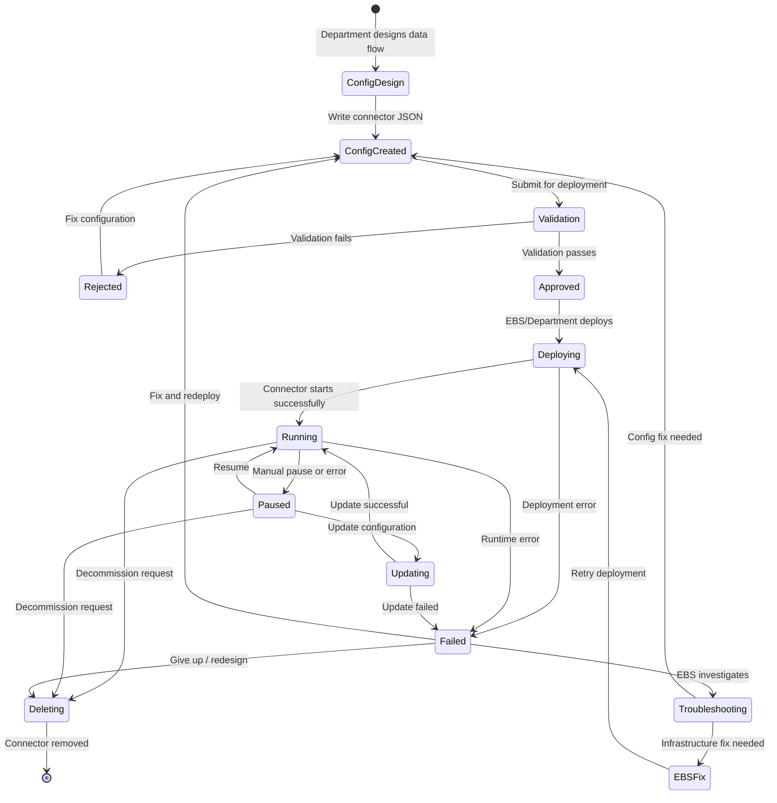
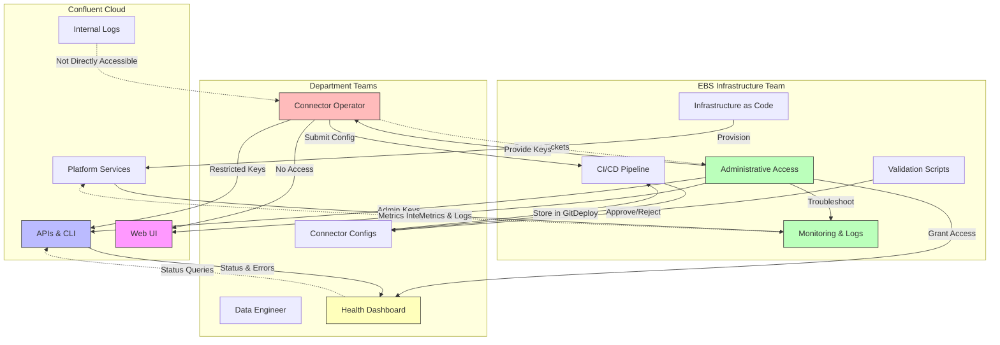

# Kafka Connect Operations - Customer-Specific Requirements

**Version:** 1.0
**Date:** 2025-12-17
**Based on:** Operational Workshop Transcript
**Status:** Draft

---

## Executive Summary

This document captures the operational model for Kafka Connect in a **three-party shared infrastructure** where:
- **EBS Infrastructure Team** manages the Confluent Cloud account and network connectivity
- **Alliance Department Teams** (customers) need to deploy and manage connectors
- **Confluent Cloud** provides the managed platform

The key challenge is enabling **self-service connector operations** while maintaining control, quotas, and security in a shared multi-tenant environment where end users **do not have Confluent Cloud UI access**.

---

## 0. Customer Context and Expectations

### 0.1 Workshop Background

**Date:** 2025-12-11 15:19:28
**Participants:** EBS Infrastructure Team, Kafka Connect Stakeholders

The EBS team manages a shared Confluent Cloud environment for various internal clients ("Alliance entities"). These clients need Kafka Connect to integrate data sources (e.g., databases) with Kafka. The current operational model creates a bottleneck: end-users do not have direct access to the Confluent Cloud UI or permissions to deploy connectors themselves. The current process requires opening a ticket with EBS, which is not scalable. EBS seeks a solution allowing clients to operate more autonomously while maintaining security and control over the shared infrastructure. They are familiar with Kafka Connect generally but lack specific knowledge of its operational aspects within Confluent Cloud, particularly around multi-tenancy, logging, monitoring, and resource management.

### 0.2 Critical Pain Points

#### Pain Point 1: Undefined and Unscalable Operational Model

**Problem:**
- End-users want to use fully managed connectors but **lack necessary access and permissions** to the Confluent Cloud UI
- Current workaround: **open tickets with EBS team**, which manually handles deployment
- **Even 20 concurrent requests** would be problematic
- This central dependency creates a bottleneck and prevents user autonomy
- Roles and responsibilities for who operates Connect flows versus the underlying Connect cluster are unclear

**Impact:**
- Not scalable beyond a handful of users
- EBS team becomes a bottleneck
- Slows down all departments

**Required Solution:**
- Clear operational model with defined roles
- Self-service or semi-automated deployment process
- Scalable to 20+ concurrent departments

---

#### Pain Point 2: No Log or Metrics Visibility for End-Users

**Problem:**
- End-users **cannot access the Confluent Cloud UI**, so they are "driving blind"
- Unable to see running status, failures, or root causes
- Troubleshooting becomes impossible for them and burdens the EBS team
- Logs are crucial for diagnosing configuration errors
- While EBS could retrieve log dumps, this is slow and inefficient
- Users need access to **metrics (CPU, memory) and logs (exceptions, behavior)** to operate effectively

**Impact:**
- Every connector issue requires EBS involvement
- Departments cannot self-troubleshoot
- Extended downtime when issues occur
- EBS team overwhelmed with support requests

**Required Solution:**
- Alternative mechanism to access logs (without UI access)
- Health check dashboard showing connector status
- Integration with Dynatrace for monitoring
- Logs exported from fully managed Kafka Connect

---

#### Pain Point 3: Uncertainty About Resource Management and Isolation

**Problem:**
- Shared, multi-tenant Confluent Cloud environment raises concerns
- Fear of "noisy neighbors"—e.g., one user deploying too many connectors and exhausting a shared VM's RAM
- Do not know what **resource management features, such as quotas** (e.g., connector limits per tenant), are available in Confluent Cloud
- Do not know how **workloads can be isolated** (e.g., dedicated vs. shared Connect clusters)
- Without clarity, cannot design a robust, fair multi-tenant service

**Impact:**
- Risk of resource exhaustion
- One department could impact others
- Difficult to attribute costs
- Cannot guarantee SLAs per department

**Required Solution:**
- Understand Confluent Cloud quota capabilities
- Define isolation strategy (shared vs. dedicated)
- Implement quota enforcement mechanism
- Monitor resource usage per department

---

#### Pain Point 4: Unclear and Insecure Configuration Deployment Process

**Problem:**
- EBS team **cannot give customers direct API keys** to the Confluent account to run Terraform
- Shared clusters mean full API access would be too dangerous
- Need secure process where customers submit connector configurations (e.g., via Git repo) and EBS runs the deployment
- This introduces extra steps and potential delays
- Full lifecycle—from configuration submission to deployment and health checks—must be defined securely and efficiently

**Impact:**
- Security risk if API keys distributed
- Manual process if not automated
- Delays in deployment if EBS in critical path

**Required Solution:**
- GitOps workflow for configuration submission
- Automated validation and deployment
- Restricted API keys with RBAC (if possible)
- Clear approval workflow for production

---

### 0.3 Customer Expectations

#### Expectation 1: Comprehensive Operations Handbook

**What Customer Expects:**
- Solution design or operations handbook outlining a clear, scalable process for internal clients to use Kafka Connect
- Detail **operational procedures for integrating departments**
- EBS positioned as infrastructure provider between Confluent Cloud and end-users
- Move from manual, ticket-based processes to an automated or self-service model
- Document describing **how customers can start and manage connectors**

**Deliverable Required:**
- Operational procedures document (this document)
- Step-by-step workflows with diagrams
- Role definitions and responsibilities
- Runbooks for common operations

---

#### Expectation 2: Independent Monitoring and Troubleshooting

**What Customer Expects:**
- Solution enabling clients to independently monitor and troubleshoot connectors
- Mechanisms to **access logs and view health status/metrics**
- Integration with existing monitoring tool, **Dynatrace**
- If direct UI access not possible, provide alternative methods:
  - Exporting logs from fully managed Kafka Connect
  - Building a health-check dashboard using the Connect API

**Deliverable Required:**
- Logging and monitoring strategy (documented in Section 5.3-5.4)
- Health check dashboard
- Dynatrace integration plan
- Confluence engagement for log export feature

---

#### Expectation 3: Clarity on Multi-Tenancy Capabilities

**What Customer Expects:**
- Clarity on Kafka Connect capabilities and limitations within Confluent Cloud for multi-tenancy
- Options for **resource isolation** (shared vs. dedicated clusters)
- Options for **resource management** (quotas on connectors or tasks)
- Guidance on preventing noisy neighbors
- Design a stable service with fair resource allocation

**Deliverable Required:**
- Multi-tenancy strategy document (documented in Section 5.5)
- Quota enforcement mechanism (documented in Section 5.1)
- Isolation decision matrix (documented in Section 5.5)
- Monitoring for resource contention

---

#### Expectation 4: Leverage Native Confluent Tools

**What Customer Expects:**
- Use Confluent CLI where possible instead of building custom tools
- Architectural principle: "Leverage Confluent as much as possible"
- Open to giving users access to **Confluent CLI with restricted permissions**
- Balance user autonomy with EBS's control and security over central infrastructure

**Deliverable Required:**
- CLI-based workflow documentation (Section 3.1, 4.2)
- RBAC configuration for restricted API keys (Section 7.2)
- Training materials for CLI usage (Episode 01 in requirements.md)
- Comparison of native vs. custom solutions

---

### 0.4 Additional Context

**Existing Infrastructure and Practices:**
- EBS team establishes network connectivity (Private Link) between end-customer data sources and Confluent Cloud cluster **on a case-by-case basis**
- Customer uses **GitOps for other configurations** (like topics) and is considering the same model for connector configurations
- Customer already forwards metrics from Confluent to **Dynatrace** via existing integration
- Similar approach could be built for logs (e.g., a Kubernetes pod reading from a Kafka topic and forwarding to Dynatrace)
- Terraform demo in progress to showcase end-to-end network connectivity steps

**Current Capabilities:**
- Metrics collection: ✅ Already integrated with Dynatrace
- Network connectivity: ✅ Process established (Private Link)
- GitOps workflows: ✅ Used for topic management
- CLI distribution: 🔶 Possible but not yet configured

**Gaps:**
- Log visibility: ❌ Not available for end-users
- Quota enforcement: ❌ Mechanism not defined
- Connector deployment automation: ❌ Manual process currently
- Self-service access: ❌ No API keys for departments

---

### 0.5 AI-Suggested Solutions from Workshop

The AI analysis from the workshop identified four potential solutions to address the pain points:

#### Solution 1: CLI-Based Self-Service with RBAC ⭐ Recommended

- Provide end-users the Confluent CLI with restricted roles and service accounts
- Users manage only their own connectors (create, describe, delete) via CLI
- No UI or infrastructure access required
- Leverages native Confluent tooling
- Reduces custom development
- Gives users control and visibility (including log access via CLI)

**Status:** Documented in Section 3.1 (Option B) and Section 4.2

---

#### Solution 2: GitOps-Driven Automation ⭐ Recommended

- Formalize a GitOps workflow
- Dedicated repo holds declarative connector configs (JSON/YAML)
- CI/CD pipeline triggers on commits
- Validates naming conventions, resource limits
- Uses service account to apply configs to Confluent Cloud via Terraform or CLI
- Yields an auditable, automated, controlled path

**Status:** Documented in Section 3.1 (Option A) and Section 4.1

---

#### Solution 3: Centralized Monitoring & Alerting Hub

- Solve visibility gap by sinking connector logs to dedicated Kafka topic
- Build lightweight service (Kubernetes pod) that consumes from this topic
- Forward logs to Dynatrace
- Create tenant-specific dashboards and alerts in Dynatrace
- Additionally, create internal dashboard using Kafka Connect REST API
- Display real-time connector status (`RUNNING`, `FAILED`)

**Status:** Documented in Section 5.3 (Three-Tier Logging Strategy)

---

#### Solution 4: Hybrid Model (CLI + GitOps) ⭐⭐ MOST Recommended

- Use GitOps for initial connector provisioning (governance and proper setup)
- Allow users (with restricted service accounts) to use CLI for operational tasks:
  - Pause, resume, status, logs
- Balances centralized control with user agility
- Best of both worlds

**Status:** Documented in Section 3.2 (Hybrid Model - Recommended)

---

## 1. Organizational Context

### 1.1 Three-Party Model

```
┌─────────────────────────────────────────────────────────────┐
│                    Confluent Cloud                          │
│                  (Platform Provider)                        │
│  - Owns the platform infrastructure                         │
│  - Provides APIs, CLI, and UI                               │
│  - Manages underlying Kafka Connect resources               │
└──────────────────┬──────────────────────────────────────────┘
                   │
                   │ Account owned by EBS
                   │ API Keys managed by EBS
                   │
┌──────────────────▼──────────────────────────────────────────┐
│              EBS Infrastructure Team                        │
│            (Intermediate Operator)                          │
│  - Owns Confluent Cloud account                             │
│  - Manages network connectivity (Private Link)              │
│  - Provisions infrastructure via Terraform                  │
│  - Enforces quotas and naming conventions                   │
│  - Deploys connectors OR provisions restricted API keys     │
└──────────────────┬──────────────────────────────────────────┘
                   │
                   │ Restricted API keys
                   │ GitOps repo access
                   │ Health check dashboard
                   │
┌──────────────────▼──────────────────────────────────────────┐
│         Alliance Department Teams                           │
│              (End Customers)                                │
│  - Department 1: RDS Postgres → Kafka                       │
│  - Department 2: Kafka → S3 Analytics                       │
│  - Department N: Other data sources/sinks                   │
│  - Define connector configurations                          │
│  - Monitor connector health                                 │
│  - Troubleshoot via logs (limited access)                   │
└─────────────────────────────────────────────────────────────┘
```

### 1.2 Key Constraints

1. **Shared Infrastructure**
   - Kafka clusters are shared across multiple departments
   - Kafka Connect resources are attached to Kafka clusters (shared)
   - Need isolation mechanisms to prevent cross-team interference

2. **Access Restrictions**
   - Department teams **CANNOT** access Confluent Cloud UI
   - Department teams **MAY** use Confluent CLI with restricted API keys
   - Full administrative access remains with EBS team

3. **Security Requirements**
   - Multi-tenancy requires quota enforcement
   - Naming conventions prevent conflicts
   - Network connectivity established per department
   - Secrets managed centrally (not exposed to departments)

4. **Operational Philosophy**
   - "Leverage Confluent as much as possible" (architectural principle)
   - Avoid building custom tooling where Confluent provides solutions
   - Enable self-service with guardrails

---

## 2. Role Definitions

### 2.1 EBS Infrastructure Team

**Responsibilities:**
- **Network Connectivity:** Establish Private Link between department VPCs and Confluent Cloud
- **Account Management:** Own Confluent Cloud account, manage billing, provision environments
- **Infrastructure Provisioning:** Deploy Kafka clusters, Connect clusters, network resources via Terraform
- **Access Control:** Create and distribute API keys with appropriate RBAC permissions
- **Quota Enforcement:** Implement and enforce quotas for connectors, topics, throughput
- **Naming Convention Enforcement:** Validate connector names to prevent conflicts
- **Configuration Validation:** Review and validate connector configurations before deployment
- **Monitoring & Alerting:** Integrate Confluent metrics with Dynatrace
- **Troubleshooting:** Access full logs for debugging production issues
- **Deployment (Option A):** Deploy connectors on behalf of departments via GitOps
- **Enablement (Option B):** Provide restricted CLI access for department self-service

**Tools:**
- Terraform (infrastructure as code)
- Confluent Cloud UI (administrative access)
- Confluent CLI (administrative operations)
- Custom validation scripts (quotas, naming)
- Dynatrace (monitoring)
- Git repository (infrastructure configs)

**Skills Required:**
- Confluent Cloud platform expertise
- AWS networking (Private Link, VPC Endpoints)
- Terraform
- Kafka Connect operations
- Monitoring and observability

---

### 2.2 Department Connector Operator

**Responsibilities:**
- **Connector Design:** Define data flow requirements (source → topic → sink)
- **Configuration Creation:** Write connector JSON configurations
- **Testing:** Test connectors in development environment
- **Deployment Request:** Submit connector configs via Git (Option A) or deploy via CLI (Option B)
- **Health Monitoring:** Check connector status via health dashboard
- **Troubleshooting (Limited):** Diagnose issues using available logs/metrics
- **Lifecycle Management:** Request connector updates, pause/resume, deletion
- **Compliance:** Follow naming conventions and stay within quotas

**Tools:**
- Confluent CLI (with restricted API key) - Option B
- Git repository (submit connector configs)
- Health check dashboard (web-based)
- Connector configuration templates
- Documentation and runbooks

**Skills Required:**
- Understanding of Kafka Connect concepts
- JSON configuration
- Data pipeline design
- Basic troubleshooting

**Constraints:**
- **NO** Confluent Cloud UI access
- **NO** access to underlying infrastructure
- **LIMITED** log visibility (via CLI or health dashboard)
- **MUST** operate within assigned quotas
- **MUST** follow naming conventions

---

### 2.3 Department Developer/Data Engineer

**Responsibilities:**
- **Requirements Definition:** Specify what data needs to be ingested/exported
- **Schema Design:** Define Avro/JSON schemas if using Schema Registry
- **Solution Design:** Design end-to-end data pipeline
- **Testing Support:** Provide test data and validation criteria
- **Consumer Application Development:** Build applications consuming from Kafka topics

**Tools:**
- Kafka CLI tools (console producer/consumer)
- Schema Registry CLI
- Application development frameworks
- Testing tools

**Skills Required:**
- Data modeling
- Kafka basics (topics, partitions, consumer groups)
- Application development

---

### 2.4 Confluent Platform Engineer (Conceptual)

**Note:** This role doesn't exist in the customer organization but represents Confluent Cloud operations

**Responsibilities:**
- Operate underlying Kafka Connect cluster infrastructure
- Provide APIs, CLI, and UI
- Handle platform-level incidents
- Scale resources as needed
- Maintain connector plugins

---

## 3. Operational Model

### 3.1 Deployment Options

Two deployment models were discussed:

#### Option A: GitOps with EBS-Managed Deployment

**Process:**
1. Department creates connector configuration JSON
2. Department commits config to Git repository
3. Pull request triggers automated validation:
   - JSON syntax check
   - Quota enforcement check
   - Naming convention validation
   - Required fields verification
4. EBS team reviews and approves PR
5. Merge triggers automated deployment via CI/CD
6. Connector deployed using EBS administrative API keys
7. Department receives health check dashboard link

**Pros:**
- Full control for EBS team
- Audit trail in Git
- Automated validation
- No need to distribute API keys

**Cons:**
- EBS team in critical path
- Slower deployment cycle
- Ticket-based scalability concerns

---

#### Option B: Self-Service via Confluent CLI

**Process:**
1. EBS team provisions restricted API key for department
2. Department operator installs Confluent CLI
3. Department operator authenticates with API key
4. Department operator deploys connector directly:
   ```bash
   confluent connect create --config-file postgres-source.json
   ```
5. Automated validation enforced by RBAC and quotas
6. Department operator monitors via CLI:
   ```bash
   confluent connect describe <connector-name>
   confluent connect status <connector-name>
   ```

**Pros:**
- True self-service (scalable)
- Faster deployment cycle
- Uses Confluent native tools
- Department has direct visibility

**Cons:**
- Requires distributing API keys
- Less control over deployment timing
- Requires quota enforcement in Confluent (if available)
- Naming convention enforcement harder

---

### 3.2 Hybrid Model (Recommended)

**Development/Testing:** Option B (Self-Service CLI)
- Departments test in dev environment with CLI
- Fast iteration and learning
- No EBS intervention needed

**Production Deployment:** Option A (GitOps)
- Production requires review and approval
- Full audit trail
- EBS validates before deployment
- Controlled rollout

---

## 4. Operational Workflows

### 4.1 Connector Deployment Flow (GitOps Model)



---

### 4.2 Connector Deployment Flow (Self-Service CLI Model)



---

### 4.3 Network Connectivity Establishment (One-Time Per Department)

```mermaid
sequenceDiagram
    autonumber

    participant Dept as Department
    participant EBS as EBS Platform Team
    participant TF as Terraform
    participant AWS as AWS (VPC / PrivateLink / DNS)
    participant Kafka as Kafka / WarpStream

    Dept->>EBS: Request Kafka Access

    EBS->>EBS: Assess Requirements
    EBS->>EBS: Design Network Architecture
    EBS->>TF: Create Terraform Modules

    TF->>AWS: Deploy PrivateLink
    AWS->>AWS: Create VPC Endpoint
    AWS->>AWS: Configure Security Groups
    AWS->>AWS: Configure Route53 DNS

    EBS->>Kafka: Test Connectivity

    alt Connection successful
        EBS->>Kafka: Provision Kafka Resources
        Kafka->>Kafka: Create Topics
        Kafka->>Kafka: Create Service Account
        Kafka->>Kafka: Generate API Keys
        Kafka->>Kafka: Assign RBAC Roles

        EBS->>Dept: Handoff Access Details
        Dept->>Kafka: Test Connectivity
        Dept-->>Dept: Ready for Connector Deployment
    else Connection failed
        EBS->>EBS: Debug Network Issues
        EBS->>Kafka: Retest Connectivity
    end

```mermaid
flowchart TD
    Start([Department Requests Kafka Access])

    Start --> Assess[EBS: Assess Requirements]
    Assess --> Design[EBS: Design Network Architecture]
    Design --> Terraform[EBS: Create Terraform Modules]

    Terraform --> PrivateLink[Deploy AWS Private Link]
    PrivateLink --> VPCEndpoint[Create VPC Endpoint]
    VPCEndpoint --> SecurityGroups[Configure Security Groups]
    SecurityGroups --> DNS[Configure Route53 DNS]

    DNS --> TestConn[EBS: Test Connectivity]
    TestConn --> ConnSuccess{Connection Successful?}

    ConnSuccess -->|No| Debug[Debug Network Issues]
    Debug --> TestConn

    ConnSuccess -->|Yes| Provision[Provision Kafka Resources]
    Provision --> Topics[Create Topics]
    Topics --> ServiceAccount[Create Service Account]
    ServiceAccount --> APIKeys[Generate API Keys]
    APIKeys --> RBAC[Assign RBAC Roles]

    RBAC --> Handoff[Handoff to Department]
    Handoff --> DeptTest[Department: Test Connectivity]
    DeptTest --> Ready([Ready for Connector Deployment])
```

---

### 4.4 Troubleshooting Workflow



---

## 5. Technical Requirements from Transcript

### 5.1 Quota Management

**Requirement:** Enforce quotas per department to prevent resource exhaustion

**Challenges Identified:**
- Kafka Connect may not have built-in per-tenant quotas
- Shared Connect cluster resources (memory, CPU) are finite
- Need to prevent one department from consuming all resources

**Solutions:**

**Option 1: Confluent Cloud Native Quotas (If Available)**
```bash
# Check if quotas can be set via CLI/API
confluent connect cluster quota set \
  --service-account sa-dept-1 \
  --max-connectors 5 \
  --max-tasks-per-connector 3
```

**Option 2: Custom Validation Script (GitOps)**
```python
# Part of CI/CD validation
def check_quota(department, connector_count):
    quotas = {
        "dept-1": {"max_connectors": 5},
        "dept-2": {"max_connectors": 3},
    }
    current = get_current_connector_count(department)
    if current + connector_count > quotas[department]["max_connectors"]:
        raise QuotaExceededException(f"{department} exceeds quota")
```

**Option 3: RBAC-Based Isolation**
- Create separate Connect clusters per department
- Use dedicated Kafka clusters for high-isolation needs
- Trade-off: Higher cost vs. better isolation

**Recommendation:** Start with custom validation in GitOps, migrate to native quotas if/when available

---

### 5.2 Naming Convention Enforcement

**Requirement:** Prevent connector name conflicts across departments

**Naming Pattern:**
```
<department-code>-<data-source>-<connector-type>-<environment>-<suffix>

Examples:
- dept1-postgres-source-prod-001
- dept2-s3-sink-dev-analytics
- finance-salesdb-source-prod-cdc
```

**Validation Rules:**
```python
import re

NAMING_PATTERN = r'^[a-z0-9]+(-[a-z0-9]+)*$'
RESERVED_PREFIXES = ['connect', 'confluent', 'system', 'admin']
MAX_LENGTH = 64

def validate_connector_name(name, department):
    # Must start with department prefix
    if not name.startswith(f"{department}-"):
        raise ValueError(f"Name must start with '{department}-'")

    # Check pattern
    if not re.match(NAMING_PATTERN, name):
        raise ValueError("Invalid characters in name")

    # Check length
    if len(name) > MAX_LENGTH:
        raise ValueError(f"Name exceeds {MAX_LENGTH} characters")

    # Check reserved prefixes
    for prefix in RESERVED_PREFIXES:
        if name.startswith(prefix):
            raise ValueError(f"Cannot use reserved prefix '{prefix}'")

    return True
```

**Enforcement:**
- **GitOps:** Automated check in CI/CD pipeline
- **CLI:** RBAC restricts service account to create only names with department prefix
- **Terraform:** Validation in variable constraints

---

### 5.3 Logging and Monitoring Strategy

#### Problem Statement (from transcript):
- Departments don't have UI access
- Fully managed Connect logs not exported by default
- Need visibility for troubleshooting
- EBS team needs full logs for support
- Balance between self-service and operational control

#### Three-Tier Logging Strategy:

**Tier 1: Department Self-Service (Limited Logs)**
```bash
# Via Confluent CLI
confluent connect describe <connector-id>
# Shows: status, configuration, basic error messages

confluent connect status <connector-id>
# Shows: task status, last error timestamp
```

**Tier 2: Health Check Dashboard (Web UI)**
```
Dashboard displays:
- Connector name, status (running/failed/paused)
- Tasks: count, failed count
- Last successful message timestamp
- Error count in last hour
- Restart button (if permissions allow)
```

**Tier 3: Full Logs via Dynatrace (EBS Only)**
```
Architecture:
[Confluent Connect]
    → [Kafka Topic: _connect-logs]
    → [Kubernetes Pod: Log Forwarder]
    → [Dynatrace API]
    → [Dynatrace Dashboard]

Department tickets EBS → EBS searches Dynatrace → provides diagnosis
```

**Feature Request to Confluent:**
```
Request: Export Kafka Connect logs from fully managed clusters

Options:
1. Stream logs to customer-owned Kafka topic
2. Push logs to CloudWatch Logs
3. Expose logs via API endpoint
4. Enable log forwarding to external systems
```

---

### 5.4 Metrics Integration with Dynatrace

**Metrics to Expose:**

**Connector-Level Metrics:**
- `connector-status` (running, failed, paused)
- `connector-failed-task-count`
- `connector-total-task-count`
- `connector-uptime`

**Task-Level Metrics:**
- `task-status`
- `task-batch-size-avg`
- `task-offset-commit-avg-time-ms`
- `task-error-rate`

**Source Connector Metrics:**
- `source-record-poll-rate`
- `source-record-write-rate`
- `source-record-active-count`

**Sink Connector Metrics:**
- `sink-record-read-rate`
- `sink-record-send-rate`
- `sink-record-lag`

**Integration Architecture:**
```
[Confluent Cloud Metrics API]
    → [Prometheus Exporter (if needed)]
    → [Existing Dynatrace Agent in K8s]
    → [Dynatrace Backend]
    → [Dashboards & Alerts]
```

**Alert Examples:**
```yaml
alerts:
  - name: "Connector Task Failed"
    condition: "connector-failed-task-count > 0"
    duration: "5 minutes"
    action: "Notify EBS team & Department"

  - name: "Connector High Error Rate"
    condition: "task-error-rate > 0.01"
    duration: "10 minutes"
    action: "Notify Department operator"

  - name: "Connector Stopped"
    condition: "connector-status == 'stopped'"
    duration: "1 minute"
    action: "Notify EBS team"
```

---

### 5.5 Isolation in Shared Clusters

**Challenge:** How to isolate department workloads on shared infrastructure

#### Isolation Levels:

**Level 1: Logical Isolation (Lowest Cost)**
```
One Kafka cluster, one Connect cluster, RBAC-based separation

Pros:
- Cost-effective
- Simple management
- Confluent manages scaling

Cons:
- Noisy neighbor potential
- One department can impact others
- Limited quota enforcement
```

**Level 2: Connect Cluster Isolation (Medium Cost)**
```
One Kafka cluster, multiple Connect clusters (one per department)

Pros:
- Connect resource isolation
- Department A connectors don't affect Department B
- Better quota control

Cons:
- Higher cost (multiple Connect clusters)
- More complex management
- Still shares Kafka cluster
```

**Level 3: Full Isolation (Highest Cost)**
```
Dedicated Kafka cluster + Connect cluster per department

Pros:
- Complete isolation
- Dedicated resources
- Independent scaling
- Clear cost attribution

Cons:
- Highest cost
- Complex management
- May not be economical for small departments
```

**Recommendation from Transcript:**
- Start with **Level 1** (shared with RBAC)
- Use quotas and monitoring to detect noisy neighbors
- Upgrade specific departments to Level 2/3 if needed
- Decision criteria:
  - High-throughput workloads → Level 2+
  - Compliance/security requirements → Level 3
  - Standard workloads → Level 1

---

## 6. Connector Lifecycle Management

### 6.1 Lifecycle States



---

### 6.2 Lifecycle Operations

| Operation | Department Operator | EBS Infrastructure Team | CLI Command | GitOps |
|-----------|--------------------|-----------------------|-------------|--------|
| **Create** | Defines config | Deploys (Option A) or approves API key (Option B) | `confluent connect create` | Merge PR to `connectors/prod/` |
| **Read/Describe** | ✅ Can view own connectors | ✅ Can view all | `confluent connect describe <id>` | Read repo |
| **Update** | ✅ Can update config | Approves changes | `confluent connect update <id>` | Merge PR with changes |
| **Pause** | ✅ Can pause (troubleshooting) | ✅ Can pause | `confluent connect pause <id>` | Commit pause command |
| **Resume** | ✅ Can resume | ✅ Can resume | `confluent connect resume <id>` | Commit resume command |
| **Delete** | ✅ Can delete (may require approval) | ✅ Can delete | `confluent connect delete <id>` | Delete file from repo |
| **View Logs** | 🔶 Limited via CLI | ✅ Full access via Dynatrace | `confluent connect logs <id>` | N/A |
| **View Metrics** | ✅ Via health dashboard | ✅ Via Dynatrace | Via CLI or dashboard | N/A |
| **Restart Tasks** | 🔶 If permitted by RBAC | ✅ Always | `confluent connect task restart <id> <task-id>` | API call |

Legend:
- ✅ = Full capability
- 🔶 = Limited capability
- ❌ = Not allowed

---

## 7. Infrastructure Provisioning (EBS Responsibility)

### 7.1 Terraform Modules Needed

Based on transcript discussion, Terraform is **only for EBS infrastructure team**, not for departments.

**Module Structure:**
```
terraform/
├── modules/
│   ├── network-connectivity/
│   │   ├── private-link.tf          # AWS Private Link setup
│   │   ├── vpc-endpoint.tf          # VPC endpoint
│   │   ├── security-groups.tf       # Security groups
│   │   ├── route53.tf               # DNS configuration
│   │   └── variables.tf
│   │
│   ├── kafka-environment/
│   │   ├── confluent-env.tf         # Confluent environment
│   │   ├── kafka-cluster.tf         # Kafka cluster (shared)
│   │   ├── schema-registry.tf       # Schema Registry
│   │   └── variables.tf
│   │
│   ├── department-onboarding/
│   │   ├── service-account.tf       # Per-department SA
│   │   ├── api-keys.tf              # Restricted API keys
│   │   ├── rbac.tf                  # RBAC role bindings
│   │   ├── topics.tf                # Department topics
│   │   └── variables.tf
│   │
│   └── kafka-connect-cluster/
│       ├── connect-cluster.tf       # Connect cluster (if dedicated)
│       ├── connector-configs.tf     # Connector Terraform resources
│       ├── dlq-topics.tf           # Dead letter queue topics
│       └── variables.tf
│
├── environments/
│   ├── dev/
│   │   ├── main.tf
│   │   ├── departments.tfvars       # Department quotas, names
│   │   └── terraform.tfvars
│   ├── staging/
│   └── prod/
│
└── connectors/                      # GitOps connector configs
    ├── dev/
    │   ├── dept1-postgres-source.json
    │   └── dept2-s3-sink.json
    ├── staging/
    └── prod/
```

---

### 7.2 Department Onboarding Process

**EBS Terraform Workflow:**

1. **Network Setup (One-time per department)**
   ```bash
   cd terraform/environments/prod
   terraform apply -var="new_department=dept3" -var="vpc_id=vpc-xxx"
   ```

2. **Service Account & API Key Creation**
   ```hcl
   resource "confluent_service_account" "dept3" {
     display_name = "dept3-connector-operator"
     description  = "Service account for Department 3 connectors"
   }

   resource "confluent_api_key" "dept3_connect" {
     display_name = "dept3-connect-api-key"
     owner {
       id = confluent_service_account.dept3.id
       # ...
     }
     managed_resource {
       id = confluent_kafka_cluster.shared.id
       # ...
     }
   }
   ```

3. **RBAC Configuration**
   ```hcl
   # Allow creating connectors with dept3- prefix only
   resource "confluent_role_binding" "dept3_connect_admin" {
     principal   = "User:${confluent_service_account.dept3.id}"
     role_name   = "ResourceOwner"
     crn_pattern = "${confluent_kafka_cluster.shared.rbac_crn}/connect-cluster=*/connector=dept3-*"
   }

   # Grant topic read/write for dept3 topics
   resource "confluent_role_binding" "dept3_topic_access" {
     principal   = "User:${confluent_service_account.dept3.id}"
     role_name   = "DeveloperWrite"
     crn_pattern = "${confluent_kafka_cluster.shared.rbac_crn}/kafka=${confluent_kafka_cluster.shared.id}/topic=dept3.*"
   }
   ```

4. **Quota Configuration** (if supported)
   ```hcl
   resource "confluent_quota" "dept3_connectors" {
     service_account = confluent_service_account.dept3.id
     quotas = {
       max_connectors = 5
       max_tasks      = 15
     }
   }
   ```

5. **Handoff to Department**
   - Provide API key (securely)
   - Provide connector templates
   - Grant access to Git repo (if GitOps)
   - Provide health dashboard URL
   - Schedule onboarding session

---

## 8. Key Questions from Transcript (Answered)

### Q1: "Who operates Kafka Connect?"
**Answer:** Three-tier operation model:
1. **Confluent Cloud** operates the underlying platform
2. **EBS Infrastructure Team** operates the account, network, and infrastructure
3. **Department Connector Operators** operate their specific connectors (with EBS support)

---

### Q2: "Who is responsible for the Connect flow?"
**Answer:**
- **EBS** is responsible for Connect **infrastructure** (cluster, network, quotas)
- **Departments** are responsible for Connect **flows** (individual connectors, data pipelines)

---

### Q3: "Why can't departments run connectors themselves?"
**Answer:** Security restrictions:
- Departments don't have Confluent Cloud UI access
- Departments don't have full API permissions
- **Solution:** Provide restricted CLI access with RBAC, or GitOps deployment

---

### Q4: "What if we have 20 people wanting connectors - is it scalable?"
**Answer:**
- **Ticket-based approach:** Not scalable (Option A only)
- **Self-service CLI approach:** Scalable (Option B)
- **Hybrid approach:** Scale with self-service, use tickets for production approvals
- **Current reality:** "We don't have 20 people waiting, so solve the problem as it appears"

---

### Q5: "How do departments see logs?"
**Answer:** Three options:
1. **Confluent CLI:** `confluent connect describe <id>` (shows basic errors)
2. **Health Dashboard:** Web UI showing status and recent errors
3. **Dynatrace:** Full logs, but **only accessible by EBS team**
4. **Feature Request:** Ask Confluent to export logs from fully managed Connect

---

### Q6: "How do we enforce quotas?"
**Answer:**
1. Check if Confluent Cloud supports native quotas (preferred)
2. If not, implement custom validation in GitOps pipeline
3. Monitor resource usage in Dynatrace
4. Upgrade to dedicated clusters if isolation needed

---

### Q7: "Is shared infrastructure viable?"
**Answer:** Yes, with caveats:
- Shared Kafka cluster → Connect resources are shared
- Use RBAC for logical isolation
- Monitor for "noisy neighbor" problems
- Upgrade specific departments to dedicated if needed
- Quotas are essential for fairness

---

## 9. Implementation Roadmap

### Phase 1: Foundation (Weeks 1-2)
- [ ] Complete Terraform for network connectivity (Private Link)
- [ ] Provision shared Kafka cluster
- [ ] Set up first department service account with restricted API key
- [ ] Test Confluent CLI access from department VPC
- [ ] Create connector configuration templates

### Phase 2: Tooling & Validation (Weeks 3-4)
- [ ] Build quota validation script
- [ ] Build naming convention validation script
- [ ] Create Git repository structure for connector configs
- [ ] Set up CI/CD pipeline for validation
- [ ] Test GitOps deployment workflow

### Phase 3: Monitoring & Visibility (Weeks 5-6)
- [ ] Integrate Confluent metrics with Dynatrace
- [ ] Build health check dashboard (web UI)
- [ ] Set up alerting rules
- [ ] Test log forwarding (if possible)
- [ ] Create Dynatrace dashboards for EBS team

### Phase 4: Documentation & Training (Weeks 7-8)
- [ ] Write operations manual (episode-based)
- [ ] Create video tutorials
- [ ] Document troubleshooting procedures
- [ ] Train first department team
- [ ] Conduct pilot deployment

### Phase 5: Scale & Optimize (Ongoing)
- [ ] Onboard additional departments
- [ ] Refine quota sizing based on usage
- [ ] Optimize connector configurations
- [ ] Collect feedback and iterate
- [ ] Evaluate dedicated cluster needs

---

## 10. Open Questions & Action Items

### Open Questions

1. **Confluent Cloud Quotas:**
   - Does Confluent Cloud support per-service-account connector quotas?
   - If yes, how to configure via Terraform?
   - If no, timeline for this feature?

2. **Log Export:**
   - Can fully managed Connect export logs to customer-owned Kafka topic?
   - Can logs be forwarded to CloudWatch/Dynatrace?
   - What is Confluent's roadmap for log observability?

3. **RBAC Capabilities:**
   - Can RBAC enforce connector naming patterns (e.g., `dept3-*` only)?
   - Can RBAC restrict connector plugin usage?
   - What is the granularity of Connect permissions?

4. **Resource Limits:**
   - What are the default resource limits for shared Connect clusters?
   - How many connectors/tasks per cluster?
   - How to monitor resource utilization?

5. **Isolation:**
   - When should we recommend dedicated vs. shared clusters?
   - Cost implications of different isolation levels?
   - Can we mix shared and dedicated in one environment?

### Action Items

**For EBS Infrastructure Team:**
- [ ] Test Confluent CLI from department VPC
- [ ] Verify RBAC can restrict connector name prefixes
- [ ] Research Confluent quota capabilities
- [ ] Open Confluent support case for log export feature
- [ ] Define quota sizes per department tier (small/medium/large)

**For Confluent Engagement:**
- [ ] Feature request: Export fully managed Connect logs
- [ ] Feature request: Per-service-account connector quotas
- [ ] Consultation: Best practices for multi-tenant Connect

**For Documentation:**
- [ ] Document API key distribution process (secure)
- [ ] Write runbook: Connector deployment via CLI
- [ ] Write runbook: Connector deployment via GitOps
- [ ] Write runbook: Troubleshooting failed connectors
- [ ] Create architecture diagrams

---

## 11. Success Criteria

1. **Self-Service Capability:**
   - Departments can deploy connectors without EBS involvement (dev environment)
   - Production deployment requires approval but is fast (<1 hour)

2. **Visibility:**
   - Departments have real-time health status for their connectors
   - EBS team has full logs and metrics for troubleshooting
   - Alerts notify both department and EBS on failures

3. **Isolation & Fairness:**
   - No department can exceed quotas
   - No "noisy neighbor" issues reported
   - Clear cost attribution per department

4. **Operational Efficiency:**
   - EBS team spends <2 hours/week on connector operations
   - 80% of connector deployments succeed first time
   - Mean time to resolution for failures: <30 minutes

5. **Scalability:**
   - Platform supports 20+ departments
   - Each department can operate 5-10 connectors independently
   - Onboarding new department takes <1 day

---

## 12. Conclusion

The operational model for Kafka Connect in this environment requires balancing:
- **Self-service** (department autonomy) vs. **Control** (EBS governance)
- **Shared infrastructure** (cost) vs. **Isolation** (performance/security)
- **Confluent native tools** (leverage platform) vs. **Custom tooling** (specific needs)

**Key Principles:**
1. "Leverage Confluent as much as possible" - use CLI, APIs, and native features
2. Departments operate via Confluent CLI with restricted API keys (preferred)
3. GitOps for production deployments with validation gates
4. Health checks for departments, full logs for EBS
5. Quotas and naming conventions enforced programmatically
6. Start simple (shared clusters), scale selectively (dedicated when needed)

**Next Steps:**
1. Validate technical capabilities with Confluent support
2. Complete Terraform infrastructure modules
3. Test end-to-end workflow with pilot department
4. Document and train
5. Roll out incrementally

---

## Appendix A: Role Interaction Matrix



---

## Appendix B: Decision Matrix - Deployment Models

| Factor | GitOps (Option A) | Self-Service CLI (Option B) | Hybrid (Recommended) |
|--------|-------------------|----------------------------|----------------------|
| **Deployment Speed** | ⚠️ Slow (PR review) | ✅ Fast (immediate) | ✅ Fast (dev), ⚠️ Controlled (prod) |
| **EBS Team Load** | ❌ High (always involved) | ✅ Low (only issues) | ⚠️ Medium (prod approvals) |
| **Audit Trail** | ✅ Full (Git history) | ⚠️ Limited (API logs) | ✅ Full (Git for prod) |
| **Access Control** | ✅ Strong (PR approval) | ⚠️ RBAC-dependent | ✅ Strong (prod), ⚠️ Flexible (dev) |
| **Scalability** | ❌ Limited by EBS capacity | ✅ Self-service scales | ✅ Scales with automation |
| **Learning Curve** | ⚠️ Medium (Git workflows) | ✅ Low (CLI commands) | ⚠️ Medium (both models) |
| **Department Autonomy** | ❌ Low (wait for approval) | ✅ High (self-deploy) | ✅ High (dev), ⚠️ Controlled (prod) |
| **Error Prevention** | ✅ High (validation gates) | ⚠️ Depends on RBAC | ✅ High (prod), ⚠️ Learning (dev) |
| **Troubleshooting** | ⚠️ EBS has full context | ✅ Dept sees errors directly | ✅ Best of both |
| **Cost** | ⚠️ EBS time = cost | ✅ Low operational cost | ✅ Optimized |

**Legend:**
- ✅ = Strong advantage
- ⚠️ = Moderate/depends
- ❌ = Disadvantage

**Recommendation:** Hybrid Model
- Development: Self-service CLI for fast iteration
- Production: GitOps for governance and audit

---

**Document Version History:**

| Version | Date | Author | Changes |
|---------|------|--------|---------|
| 1.0 | 2025-12-17 | Infrastructure Team | Initial draft based on operational workshop transcript |

